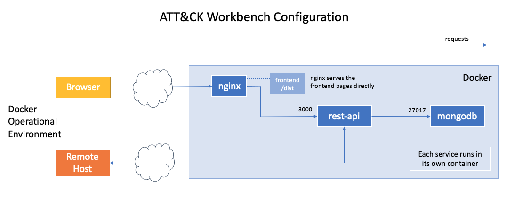

# Docker Compose Installation

This document describes how to install the ATT&CK Workbench components using Docker Compose. This project (ATT&CK Workbench Frontend) includes a `docker-compose.yml` file that configures the Docker Compose installation.

## 1. Download required repositories

In addition to this project, the [ATT&CK Workbench REST API](https://github.com/center-for-threat-informed-defense/attack-workbench-rest-api) and [ATT&CK Workbench Collection Manager](https://github.com/center-for-threat-informed-defense/attack-workbench-collection-manager) projects must be pulled from their github repositories.

These projects must be placed under a common parent directory:

```
|-- <common parent directory>
    |-- attack-workbench-frontend
    |-- attack-workbench-rest-api
    |-- attack-workbench-collection-manager
```

To perform all three clones as required (including the clone of this repository), you can use the following commands from your working directory:
```shell
# download the front-end repository
git clone https://github.com/center-for-threat-informed-defense/attack-workbench-frontend.git
# download the collection manager repository
git clone https://github.com/center-for-threat-informed-defense/attack-workbench-collection-manager.git
# download the REST API repository
git clone https://github.com/center-for-threat-informed-defense/attack-workbench-rest-api.git
```

## 2. Docker images

Docker images can either be built locally or pulled from the Github Container Registry. 

### Build docker images
1. Navigate to the `attack-workbench-frontend` directory (containing the `docker-compose.yml` file)
2. Run the command:
```shell
docker-compose up
```

This command will build all of the necessary Docker images and run the corresponding Docker containers.

### Using pre-built images
1. Use the following commands to pull the images from the Github Container Registry. Replace the image tag with the version number you are using. 
```
docker pull ghcr.io/center-for-threat-informed-defense/attack-workbench-frontend-frontend:<TAG>
docker pull ghcr.io/center-for-threat-informed-defense/attack-workbench-frontend-rest-api:<TAG>
```
2. Navigate to the `attack-workbench-frontend` directory, and modify the `docker-compose.yml` file. Replace the `build` attribute with the corresponding `image`. 
```
version: "3.9"
services:
  frontend:
    container_name: attack-workbench-frontend
    image: ghcr.io/center-for-threat-informed-defense/attack-workbench-frontend-frontend:<TAG>
    depends_on:
...
  rest-api:
    container_name: attack-workbench-rest-api
    image: ghcr.io/center-for-threat-informed-defense/attack-workbench-frontend-rest-api:<TAG>
    depends_on:
...
```
3. Run the command:
```shell
docker-compose up
```

## 3. Access Docker instance

With the docker-compose running you can access the ATT&CK Workbench application by visiting the URL `localhost` in your browser.


## Updating an existing install

If you have previously built the Workbench and want to rebuild based on a newer release of the codebase, the following command can be used to force a rebuild of the data. Before running it, make sure that all three repositories are up-to-date with the head of the branch (typically `develop` or `master`) to ensure that compatibility issues don't occur between the components.

```
docker-compose up --build
```

## Containers

When deployed using Docker Compose, an ATT&CK Workbench installation will include four containers:
* frontend
* rest-api
* collection-manager
* mongodb

These containers will communicate as illustrated in the diagram below.
The `nginx` instance (part of the `frontend` container) is responsible for serving the statically built code for the ATT&CK Workbench web application.
It also acts as a reverse proxy for the `rest-api` and `collection-manager` services.



Note that the `docker-compose.yml` file exposes the ATT&CK Workbench web application on port 80.
The `nginx` configuration file (`nginx/nginx.conf`) can be modified to use HTTPS and port 443, depending on your operational requirements.

## PKI Certificates

For additional troubleshooting and installation of security certificates for use by ATT&CK Workbench, pleaser refer to [PKI Certificates instructions](certs.md).
